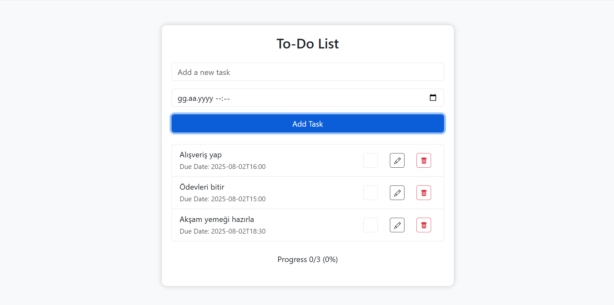

# To-Do List Uygulaması

Bu, HTML, CSS ve JavaScript kullanarak yapılmış basit bir yapılacaklar listesi uygulamasıdır. Görev ekleyebilir, tamamlayabilir, düzenleyebilir ve silebilirsiniz. Tamamlanan görevlerin yüzdesi gösterilir.

## Özellikler
- Görev ekleme, düzenleme, silme
- Görev tamamlama ve ilerleme gösterme
- Duyarlı tasarım (Bootstrap kullanımı)

## Kullanım
1. Görev adı ve tarihini girip "Add Task" butonuna tıklayın.
2. Görevleri tamamlayın, düzenleyin veya silin.
3. Tamamlanan görevlerin yüzdesi otomatik olarak hesaplanır.

## Teknolojiler
- HTML
- CSS (Bootstrap)
- JavaScript
